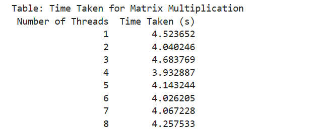
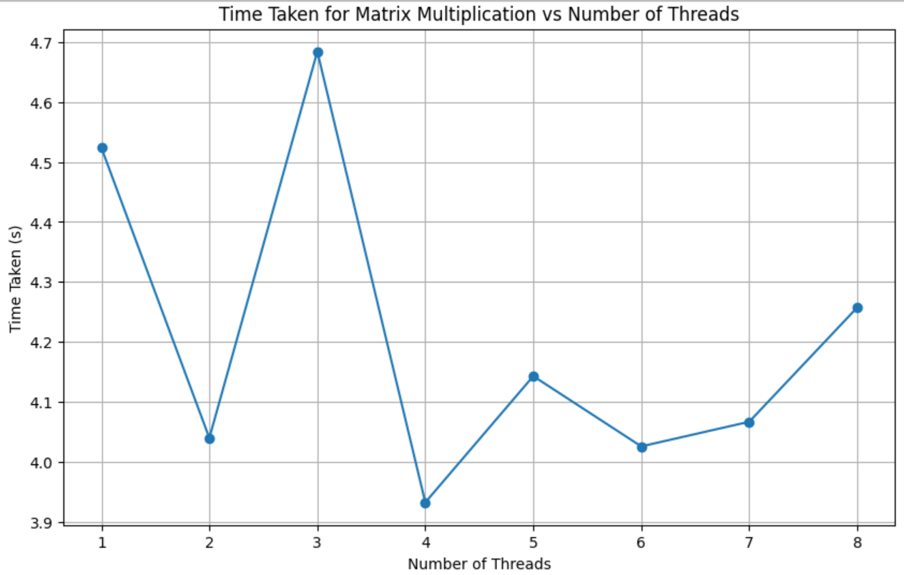
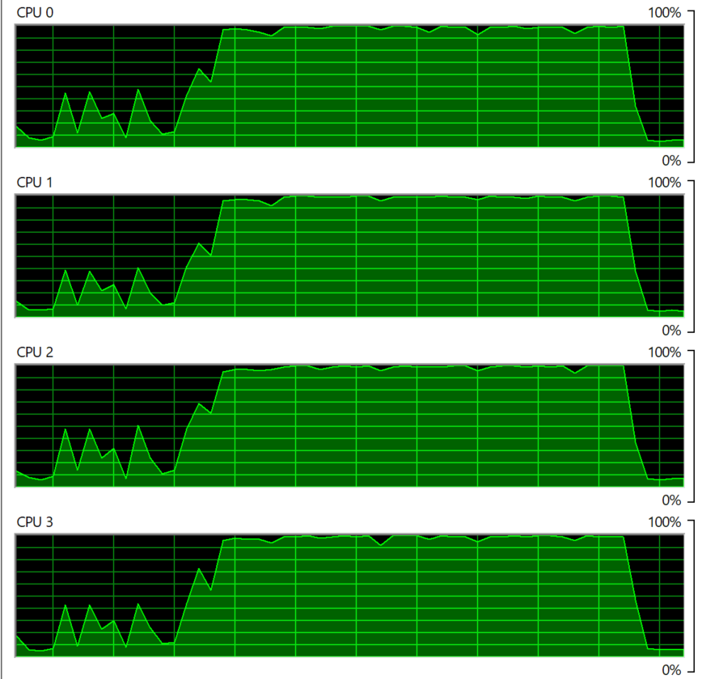

# Multi_Threading
Assignment on Multi Threading

## Methodology
1. The generate_random_matrix function creates a random matrix of size 1000x1000.
2. The multiply function performs matrix multiplication between a given matrix and a constant matrix.
3. The multiply_with_threads function takes a list of matrices and the number of threads to use. Then it uses the concurrent.futures.ThreadPoolExecutor to distribute the matrix multiplication tasks among multiple threads. It measures the time it takes to complete the multiplication.
4. Now we generate a list of 100 random matrices using the generate_random_matrix function.
5. Measure the time taken to multiply matrices by specific number if threads (1 to 8).
6. Display the results in a table and plot a graph for execution time.

## Time Taken(s) vs Number of Threads Table

## Time Taken(s) vs Number of Threads Graph

## CPU Usage

